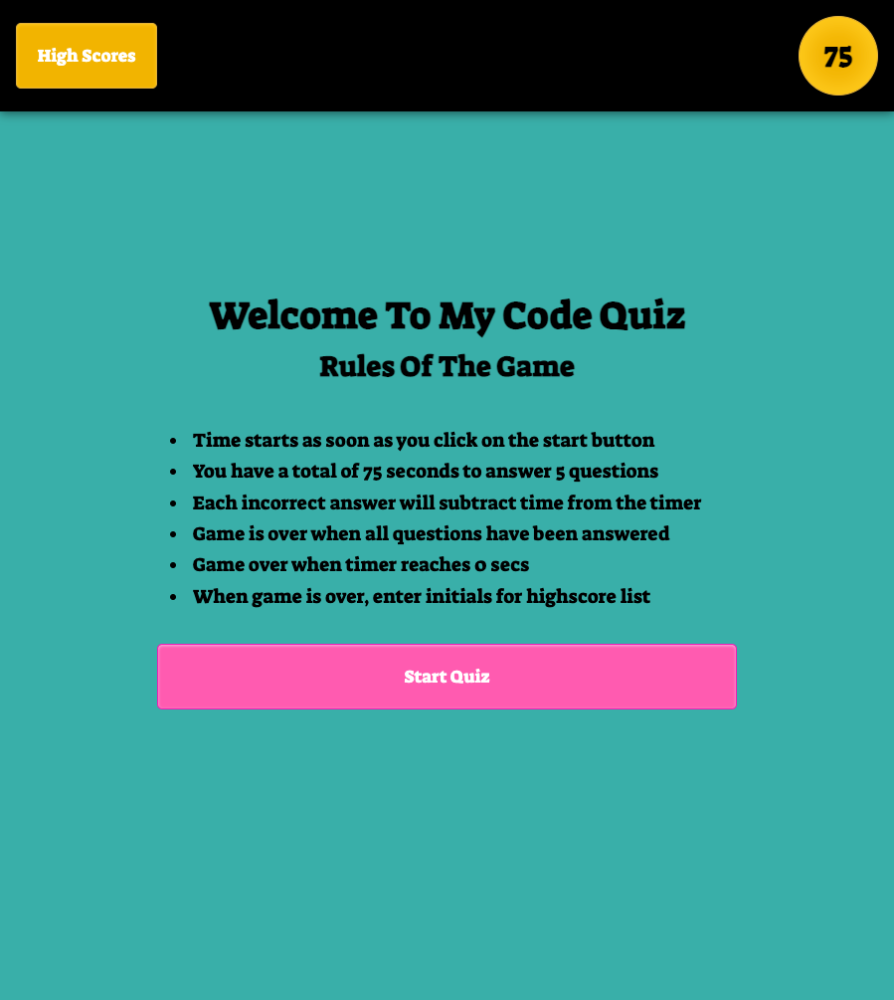

# miniature-telegram

Assignment: Code Quiz

Developer: Mehdi Mehrabani

For this week, we were tasked with building a timed coding quiz app with multiple-choice questions. In the week prior, our focus was on Web APIs and as a result, learning about this topic became extremely important in the success of building this app.

To be honest, I had no idea what Web API’s were until this assignment. The term API seems to be used all the time, and majority of people will just nod their heads when asked if they know what they are. Unless you are utilizing the topic for your own personal projects, you don’t have a clue. For this reason, I had to brush up on the learning done during class before attempting this assignment.

API stands for Application Programming Interface. To understand the purpose of APIs see the below example from MDN Web Docs.

> "think about the electricity supply in your house, apartment, or other dwellings. If you want to use an appliance in your house, you plug it into a plug socket and it works. You don't try to wire it directly into the power supply — to do so would be really inefficient and, if you are not an electrician, difficult and dangerous to attempt."

There are two types of Web APIs: Browser APIs and Third-Party APIs. For this assignment, we used browser API’s in combination with Javascript to create this app.

If you want more information on the basics of API, check out this link [Introduction to web APIs](https://developer.mozilla.org/en-US/docs/Learn/JavaScript/Client-side_web_APIs/Introduction)

In addition to understanding the basics of Web APIs, I wanted to know more on the qualities of a good app. From my research, below are the top 5 qualities after you’ve come up with your world changing idea.

1. The Design – The app needs to look good
2. The User Interface – Interaction with the app should be easy
3. Cross Platform Functionality – Should be compatible with different operating systems
4. Speed – No one likes slow loading times.
5. Offline Usage – Not everyone has unlimited data.

If you want a good guide to building an app, check out this link [The beginner’s advanced guide to building an app](https://uxdesign.cc/break-it-down-or-the-making-of-an-app-part-i-b2f260c2dffb)

## ASSIGNMENT SUMMARY

No starter code was provided and as a result, we were required to build everything from scratch. The requirements to completing this assignment were the following.

Upon loading the code quiz app:

1. When start button is clicked, user is presented with a question
2. For each answer:
   a. If correct, user is presented with another question.
   b. If incorrect, time is subtracted from the clock
3. The game is over when:
   a. User answers all questions.
   b. Time reaches 0.
4. Once game is over, user can submit initials for high score list submission.

## Structure + Process of Writing Code

### Resources Used To Complete Assignment

1. Bootcamp
2. Udemy
3. Google & GoogleDev Tools
4. Youtube

### Steps Taken To Write Code

1. Create file structure
2. Draw a flow chart
3. Write pseudo-code
4. Design App
5. Begin writing code
6. Test
7. Debug
8. Research efficient ways of solving issues
9. Test
10. Debug
11. Submit

### File Structure

When git clone, you will find the following:

1. File: Index.html
2. File: README.md
3. Folder: Assets

   a. Folder: css

   - style.css

   b. Folder: js

   - script.js
   - questions.js: created a separate js file for the quiz questions as it made for writing the main code easier.

4. Folder: Vendors

   a. Folder: css

   - normalize.css

### Design App

I could have used the design presented in the homework assets folder, but I love applying my own flare, so I took time to make the app look fun. I will just assume, when you’re taking a quiz, you’re preparing for an exam, and as such, anything that can reduce stress and increase usability is a plus.

1. For the font, I used google fonts family “Suez One” styling. It gave it a more playful feel.
2. For the color scheme, I wanted to make the game more engaging so I used a mixture of orange, teal and pink. See image of the final app at the end of this readme.doc
3. For the buttons, I applied a border radius to make them more rounded and applied a hover effect for when the user places cursor directly on the button.
4. For the clock / timer, instead of just writing “Time Remaining”, I used a circle with number ticking down once quiz starts.

I probably spent more time on the design than I should have, but at the end, I think it added to the fun factor.

### Writing Code

[A] HTML Structure

1. Header
   a. `<header>`
   b. `<nav>`
   i. `<button>` - For the highscore click events in js
   ii. `
` & `` - For the clock/timer

2. Main Body Section
   a. `<section>` - 5 sections used to separate
   i. Intro
   ii. Questions
   iii. Initials
   iv. Highscores
   v. Game Over

[B] Javascript Structure

- The amount of space the questions were taking when writing the main code made for debugging issues a little bit harder. I realized I could just simply create a new .js file to house the questions, and just refer to it. By doing this, I freed myself of important space when reading the code.

1. Basic Overview

- Use of strict mode – While going through some udemy courses. From what I understand, javascript allows for simple errors to be bypassed, and by invoking the strict mode, you can catch these simple errors and debug on the spot. As a beginner, I want to see all errors just so I can try to update on the spot.

- var for `document.querySelector()` - To make referring to html elements a little easier.

- `.classList.add('hidden')` & .classList.remove('hidden') – For changing between the html sections, I created a css styling for `.hidden` to `display: none`.

2. Logic of Code

- Start Quiz Button + Click Event
  a. Added a click event for the Start Quiz button. This click event also housed the function to:

  i. Start the question loading process by calling on the setQuestion() function.

  ii. Start the countdown by calling on countdown() which reduces the initial 75secs clock by 1 second.

  iii. Load highscores from local storage by calling on `init()`. The purpose of this `init()` is to load the highscores since my “Go Back” button utilizes the javascript `location.reload()`.

- The Timer / Clock functionality is placed under a function called countdown().
  a. If timer is greater than 0 and if qcount is less than the quizData length, then continue to reduce timer by 1 sec.
  b. If timer is greater than 0 and if qcount is equal to quizData length, stop timer then switch to section Initials and allow user to submit score for highscore list based on score = time left.
  c. Else, show game over section & change timer to = 0

- Quiz Data Pull Based On Click Event
  a. Quiz Data Summary – check what the `var qCount` is currently at and pull the data from the quizData array.

  b. Changing of Questions – created a click event under a for loop for the changing of the qcount and and processing the wrong or correct functionality.

- Highscores + Local Storage Section
  a. Bootcamp todo activity was extremely helpful here. In summary, after user submits score the scores and the initials are pushed into an array called highscoresArray[].
  b. This section took the most amount of time since the highscoresArray[] would need to be sorted. I was able to overcome this issue by:

  i. Pushing user submitted initials + score [time left] Into the highscoresArray[].

  ii. Sort the values based on the score.

  iii. Using the turnery operator when appending to the li list.

### Key Learning Points

[A] GoogleDev BreakPoints For Logic Check – I think the biggest learning was done when utilizing the breakpoints event watcher. There were many instances where I could not understand what the issue was and had to just go step by step over each function to check the values. A great example was for the sorting of the high scores and converting the li creations from appearing as objects on the screen to the values the user submitted.

[B] Reload Function & localStorage.clear() – Each assignment I come across a simple way of doing something that might at first feel like it requires more work. For this assignment, the two I found were the reload page function for the “Go Back” button and the localStorage.clear() to clear the high scores list.

# Image Of Final Assignment

